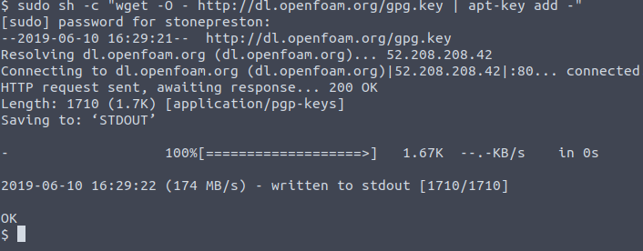
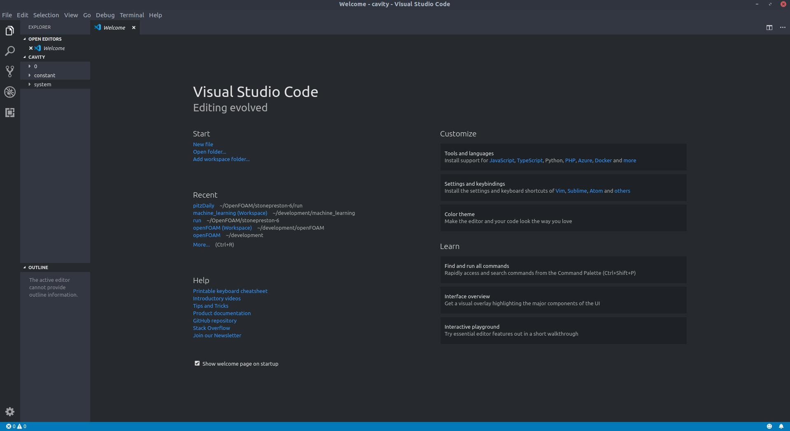
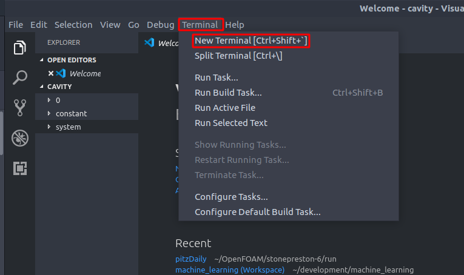

# OpenFOAM Cavity Tutorial

OpenFOAM Version: 6

Ubuntu Version: 18.04

The following tutorial aims to get a beginner linux user up to speed with using OpenFOAM with Ubuntu. A basic Unix primer is provided to help the user get aquainted with using terminal commands. The OpenFOAM walkthrough covers installation of OpenFOAM and the completion of the cavity case using BlockMesh for geometry definition. An alternative meshing approach using gmsh is also presented. 

## Basic Unix Commands

Log into your Ubuntu System. Open a terminal by pressing "cmd + a" (Mac keyboards) or "windows key + a" (Windows keyboards) to open a list of applications installed on your machine. Alternatively, you can press the menu button on the dock as shown below. Note: My icons and theme may be slightly different than yours.


Scroll down the list until you find the terminal application. You can right click the icon and add Terminal to your favorites. This will place the Terminal icon in your dock for easy access. Open Terminal by clicking the icon in the applications list or clicking it in your dock. A window like the one below will open.


Terminal allows the user to interact with a program called Bash. Bash is a type of program known as a shell and provides an interface to the system itself. A user can enter text commands to navigate the file system, install software, and do other common tasks using the shell interactively. Bash can also run script files.

### Navigating the File System

The directory system begins at the root directory represented by /. All files on the system exist within this directory. A special directory exists within / called home. The home directory contains directories corresponding to the users of the system. You will have a special directory just for you located at /home/your_username. This is referred to as YOUR home directory (whenever you see someone mention the home directory, they are usually referring to /home/your_username, not /home) and it is used quite often. This is where directories that store items like your Documents, Pictures, Downloads will be located. It is used so often that it has its own special shortcut, the tilde: ~. 

When you open Terminal, the current working directory will be your home directory. The current working directory is displayed as part of the prompt located to the left of your cursor in the terminal window. Your prompt should look something like this:

```your_username@your_computer_name:~$```

The text between the : and the $ is the current working directory. In this case you are currently in your home directory, represented by the tilde. You can also verify this using the pwd command (print working directory). You enter a command by typing its name and then pressing enter. 

```$ pwd```

Dont type the `$`. For the purposes of this tutorial, the `$` signifies the end of the terminal prompt and will be used to indicate that the following line of code is intended to be entered as a terminal command. After typing the command and pressing enter, you should see the location of your home directory printed to the screen. 


Note: If you want to paste into the terminal window, you have to use ctrl + shift + v instead of the usual ctrl + v. Similarly to copy from the terminal window to the clipboard you must use ctrl + shift + c.

We can list files and directories that exist in the current working directory by typing the ls command (short for list):

```$ ls ```

You should see a list of the familiar directories Documents, Pictures, etc. You can list the contents of a specific directory by passing the directory name as an argument to the ls command:

```$ ls Documents/ ```

Note that the terminal has an autocompletion feature. You can start typing the directory name Documents but press tab after typing the c character. It should autocomplete the rest of the name for you. Also note that we used a relative path to specify the directory name (relative to the current working directory.) We could have specified the abosolute path of the Documents directory using the root directory like so:

```$ ls /home/your_username/Documents/ ```

You can only use a relative path if the file or directory you want exists in the current working directory or in a subdirectory of the current working directory.

You probably dont have anything in this directory yet so you most likely did not see any output from the command. We will add a file to it soon. You can move to a different directory using the cd command (change directory):

```$ cd Documents/```

You will notice that your prompt changed. Now ~/Documents is between the : and the $. Your current working directory is now the Documents directory instead of ~. Let's add a file to this directory. A quick way to create a file is the touch command. We can specify a file name as an argument:

```$ touch hello_world.txt```

Let's get back to the home directory, which is one directory up from Documents. We could use ```$ cd ~``` or ```cd /home/your_username/```, but a common way to move up a single directory is to use a special dot notation:

```$ cd ../```

That should take you up one directory, back to your home directory. Another quick way to get back to ~ is to use the cd command without any arguments. 

```$ cd```

Note: If your terminal window gets too full you can clear it using the clear command:

```$ clear ```

The terminal keeps a history of previously entered commands. Let's cycle back through our previous commands until we find the command to list the contents of the Documents directory. You can cycle through the commands by pressing the up an down arrows on your keyboard. Press the up arrow until you come to the following and hit enter:

```$ ls Documents/ ```

You should see the name of your newly created text file as output. That is the basics of file system navigation. 

### Creating Directories, Copying Files, Removing Files, and Moving Files

You can make a new directory using the mkdir command (make directory). Lets create a new directory inside documents called Stuff and use an absolute path just for fun:

```$ mkdir ~/Documents/Stuff```

Change into the newly created directory:

```$ cd ~/Documents/Stuff/```

We can copy our hello_world.txt file to this directory using the cp command. The cp command takes two arguments, the source file and the destination directory. The arguments are separated by a space. Since hello_world.txt exists one directory up, we can specify its path using the ../ syntax. We can also specify the current working directory as the destination using the . (dot) shortcut:

```$ cp ../hello_world.txt .```

The dot represents the current working directory and is used quite a bit, especially when copying files. You can list the contents of Stuff and see that it now contains a copy of the hello_world.txt file.

Let's remove the copy we just made using the rm command:

```$ rm hello_world.txt ```

You can remove directories using the same command, but you have to specify a recursive force flag. Flags are specified using a - followed by the flag characters. The flags for recursive and force are r and f. Lets copy the text file again, change to the Documents directory, and then delete the non-empty Stuff directory using the rm command:

    $ cp ../hello_world.txt .
    $ cd ../
    $ rm -rf Stuff/

If you list the contents of Documents/ you should see that the Stuff directory is no longer there. We should also learn how to move files from one directory to another. Remake the Stuff directory:

```$ mkdir Stuff ```

We can move the hello_world.txt file from Documents to Stuff using the mv command. Like copy, it takes the source file and destination as arugments:

```$ mv hello_world.txt Stuff/ ```

Verify that the text file is no longer in Documents but has been moved to stuff using the ls command.

You also use the mv command to rename files. We can rename the text file like so (I used absolute paths but you could use relative if you wanted to):

```$ mv ~/Documents/Stuff/hello_world.txt  ~/Documents/Stuff/hello_world_renamed.txt ```

Verify that the name changed using the ls command. 

This marks the end of the basic Unix command primer. That covers most of what you need to start using OpenFOAM, but you will learn more and more as you go along. If you need help with a command, you can read the manual pages using the man commmand followed by the name of the command you want help with. For example, to get help with the cp command enter the following:

```$ man cp```

## OpenFOAM Installation
The [OpenFOAM Installation Instructions](https://openfoam.org/download/6-ubuntu/) briefly explain the steps required to install OpenFOAM 6 for Ubuntu. I follow the same steps but explain the purpose of the commands along the way to provide a better understanding. If you dont have Terminal open, go ahead and open it now.

To install OpenFOAM, we will use a package manager called Apt. A package manager allows the user to install, update, and remove software. There are many different package managers but we will mainly be using Apt. 

In order for Apt to install OpenFOAM, we have to add the OpenFOAM repository to the repository list (otherwise Apt would not be able to find it since OpenFOAM is not in the default repositories.) Copy and paste the following line into the terminal and hit enter (Remember: To paste into the terminal you must use ctrl + shift + v or use the right click menu.) 

```$ sudo sh -c "wget -O - http://dl.openfoam.org/gpg.key | apt-key add -"```

You will be prompted to enter your password. Enter your password and press enter. You will not be able to see the characters of your password as you type. You should see something similar to the image below if the command was successful:



The word "sudo" is short for super user do. It essentially allows commands to be executed as the "root" user. It's similar to running a command as an administrator in Windows. Some commands require sudo, some do not. You will get an error if you try and run a command that requires root privileges without specifying sudo before the command. 

The rest of that command adds a public key for package verification. This is encryption related. Don't worry too much about it.

We can now add the OpenFOAM repository to Apt using the command below. Copy and paste it into your terminal and press enter. You may be prompted to enter your password again. 

``` $ sudo add-apt-repository http://dl.openfoam.org/ubuntu ```

We now need to tell Apt to update the package list (since we just added a new repo) by running the apt-get update command below:

```$ sudo apt-get update```

Finally, install OpenFOAM 6 by using the install command:

```$ sudo apt-get -y install openfoam6```

It may take a few minutes to install.

Currently we wont be able to use the OpenFOAM collection of programs and commands in a convenient way. For example, OpenFOAM has a command called simpleFoam. Lets try using that command (we can specify the -help flag to get help with using that command.)

```$ simpleFoam -help ```

You should get an error that the command was not found. The reason is that our system does not recognize the OpenFOAM commands because it does not know where to look for them. We would have to specify the full path to the OpenFOAM commands in order to use them (typing out /opt/openfoam6/.../.../ and drilling down to the command we wanted would not be fun.)

To make it so that our system recognizes the OpenFOAM commands just by typing the command name (without having to specify the full path to the command), we can add the directories of the OpenFOAM commands to an environment variable called "The Path." The path is a list of directories that Bash searches through when you type a command. When you type a command like apt-get update, Bash looks for the command in all of the directories listed in the path variable, and when it finds it, it executes the command. You can show the current value of the path variable in the terminal using the command below:

```$ echo $PATH ```

The echo command displays whatever arguments it gets passed to the terminal window. In this case the argument that was passed was the path environment variable. Environment variable names are preceded with a $ and are usually in upper case. We will see more examples of environment variables later on. You will notice there are no OpenFOAM related directories in your path variable. Also note that the different directories are comma delimited. 

The process of adding a directory to the path is very common when using unix operating systems so it is important to know how to do it. Generally you modify the path by inserting lines of code into a special file called .bashrc. This file is an initializer script that is run when a bash session is started interactively (like when you open terminal window.) 

The .bashrc file is located in the home directory. Let's change to the home directory and list the contents:
 
    $ cd
    $ ls

However, you wont see .bashrc in the list. This is because files that begin with a period are hidden. We can show them by using the -a flag in conjunction with ls to list all files, including hidden ones:

```$ ls -a```

You should see .bashrc in the list of files now. Open it using the gedit text editor with the following command:

```$ gedit .bashrc```

You may or may not have a lot of code in this file. When an interactive shell session is started, Bash will execute every line in this .bashrc file. Luckily for us, the OpenFOAM developers provided a script that will correctly append the required directories to the $PATH variable (the script does some other stuff as well). The script is located at /opt/openfoam6/etc/bashrc. All we need to do is add a line of code to our .bashrc file that essentially says "Run the script located here" and we will be done. 

Scroll down to the very bottom of the file and add the following line (if you previously installed a different version of OpenFOAM and modified this file, you will need to remove any OpenFOAM related lines that you added previously):

```source /opt/openfoam6/etc/bashrc```

The source command instructs Bash to execute the script at the location specified. Save the file, close the terminal window, and open a new terminal window. This will start a new session and the modified .bashrc script will be executed. 

Try running the simpleFoam command again. It should work this time around:

```$ simpleFoam -help ```

OpenFOAM 6 is now installed and configured. 

# Visual Studio Code Installation

OpenFOAM requires the use of a text editor to edit files. It also requires a lot of terminal commands. If you only have one screen, switching back and forth between the terminal and the text editor can be annoying. Visual Studio Code (Note: This is not the same application as Visual Studio) is a powerful text editor that has an integrated terminal inside of it. You can edit files and run terminal commmands all in a single window. We can install it using a different package manager called Snap:

```$ sudo snap install --classic code```

You should see a success message after the installation completes. 

# The Cavity Case

Most of the content here is covered in the [Open Foam User Guide](https://cfd.direct/openfoam/user-guide/v6-cavity/). However, it is not very thorough and will probably leave you with questions. I have tried to go a bit more in depth than they do. 

OpenFOAM ships with a bunch of tutorial cases. These are important and are usually used as a starting point for cases in general. You generally don't start from scratch when using OpenFOAM. You would determine the type of problem you want to solve (steady state, transient, incompressible, compressible, multiphase, etc) and then copy a tutorial case that corresponds to that specific type of problem. You would then modify that copied tutorial case (by changing the geometry of the mesh, solver settings, fluid properties, etc) to suit your problem. 

The cavity case is probably the most basic case there is. The classic problem is that of a square fluid filled cavity with a moving lid. We will solve the problem as an incompressible, transient, laminar flow problem. We will use the OpenFOAM to solve this moving lid problem and use a program called ParaView (this is the default post processing tool that ships with OpenFOAM) to postprocess the results. 

We will begin by making a directory to store our personal cases in (You don't want to modify the tutorial cases directly, so we will copy the cavity case to this new directory.) OpenFOAM provides a special environment variable called $FOAM_RUN. This variable stores the location of the standard "run" directory where users should store all their personal cases. Echo the value of this variable to the terminal:

```$ echo $FOAM_RUN```

 Let's try changing to that  directory:

```$ cd $FOAM_RUN ```

You will see that it does not exist, so we need to create it. To create our new directory we will use the mkdir command, along with the -p flag:

```$ mkdir -p $FOAM_RUN```

The -p flag tells the mkdir command to make parent directories if needed (if the directory you are trying to create is nested within other nonexistant directories.) Now that the directory has been created, we should be able to change to it:

```$ cd $FOAM_RUN ```

We will also use another environment variable called $FOAM_TUTORIALS. This variable stores the location of the tutorial cases. We can use that variable to drill down further into the tutorials directory to the cavity case. We will copy the cavity tutorial case to the current working directory (note the use of . as the destination) using the cp command as shown below:

```$ cp -r $FOAM_TUTORIALS/incompressible/icoFoam/cavity/cavity . ```

The -r flag tells the command to recursively copy (which means it will also copy over all the necessary child directories). 
Now that we have the case copied to our run directory, change directories to it:

```$ cd cavity ```

Open the current directory in Visual Studio Code:

``` code . ```

You will see a screen similar to the one below:



Let's also go ahead and open a new integrated terminal inside Visual Studio Code. Click the Terminal button in the top toolbar, and then select New Terminal:



You can resize the height of the terminal by clicking and dragging the top of the terminal panel. Now that we have everything we need open, lets get started exploring the cavity case. 

Note the directory tree on the left hand side. You can expand the directories by clicking on them. There are currently three directories. 0 contains files that define initial and boundary conditions. We currently have files that define initial and boundary conditions for velocity and kinematic pressure. Constant contains files that define constants. We currently have a transport properties file which we will investigate later. System contains files related to geometry and solver settings. We will start by looking at how to define geometry.

BlockMesh is a mesh generation program that ships with OpenFOAM and is used to define geometry and create a mesh file. Open the blockMeshDict file that is located inside the system directory. You will see the code shown below:


    convertToMeters 0.1;

    vertices
    (
        (0 0 0)
        (1 0 0)
        (1 1 0)
        (0 1 0)
        (0 0 0.1)
        (1 0 0.1)
        (1 1 0.1)
        (0 1 0.1)
    );

    blocks
    (
        hex (0 1 2 3 4 5 6 7) (20 20 1) simpleGrading (1 1 1)
    );

    edges
    (
    );

    boundary
    (
        movingWall
        {
            type wall;
            faces
            (
                (3 7 6 2)
            );
        }
        fixedWalls
        {
            type wall;
            faces
            (
                (0 4 7 3)
                (2 6 5 1)
                (1 5 4 0)
            );
        }
        frontAndBack
        {
            type empty;
            faces
            (
                (0 3 2 1)
                (4 5 6 7)
            );
        }
    );

    mergePatchPairs
    (
    );

Let's go through the code one line at a time. Ignore the large header at the very top of the file for now.

The first line of code is shown below:

```convertToMeters 0.1;```

This defines a scaling factor that is applied to all the vertex coordinates. In this case every vertex coordinate is multiplied by .1. 

    vertices
    (
        (0 0 0)
        (1 0 0)
        (1 1 0)
        (0 1 0)
        (0 0 0.1)
        (1 0 0.1)
        (1 1 0.1)
        (0 1 0.1)
    );
    
The above code defines a list of all the vertices present in the geometry. These vertices are used to construct a block. You can have multiple blocks. In this case we define a single block as shown below:

    blocks
    (
        hex (0 1 2 3 4 5 6 7) (20 20 1) simpleGrading (1 1 1)
    );

The hex keyword describes the shape of the block (hexahedral). After the hex keyword is a list of vertices. The order the vertices are specified in when defining the block is important as this order defines the local coordinate system and adhere to these rules (remember that C++ indices start at 0):

- the axis origin is the first entry in the block definition, vertex 0 in our example;
- the x1 direction is described by moving from vertex 0 to vertex 1;
- the x2 direction is described by moving from vertex 1 to vertex 2;
- vertices 0, 1, 2, 3 define the plane x3 = 0;
- vertex 4 is found by moving from vertex 0 in the x3 direction;
- vertices 5,6 and 7 are similarly found by moving in the x3 direction from vertices 1,2 and 3 respectively.

The local coordinate system MUST be right handed. The OpenFOAM documentation states that a right-handed set of axes is defined such that to an observer looking down the z axis, with the origin nearest them, the arc from a point on the x axis to a point on the y axis is in a clockwise sense. 

If you were to draw our vertices in the order they are listed in the block definition, you will see that they do indeed adhere to the rules, and that the coordinate system is right handed. 

The code ```(20 20 1)``` defines the number of mesh cells in the x, y, and z directions for this block. We will have 20 cells in both the x and y directions and 1 cell in the z direction. We must have at least 1 cell in the z direction because OpenFOAM uses 3 dimensional meshes only. 

```simpleGrading (1 1 1)``` defines the cell expansion ratios in each direction. You can use this to create a graded mesh if you wish. In our case we want a uniform mesh with no grading, so we use ```(1 1 1)``` as the ratios. 

The edges list is used to define curved edges between vertices. All of our edges are straight lines, so it is empty:

    edges
    (
    );

Finally, the boundary list contains named patches that describe each patch type and the faces that belong to that patch. The faces are described by a list of vertices that make up that face. The order of the vertices must be such that when looking from inside the block, the vertices are traversed in a clockwise direction

    boundary
    (
        movingWall
        {
            type wall;
            faces
            (
                (3 7 6 2)
            );
        }
        fixedWalls
        {
            type wall;
            faces
            (
                (0 4 7 3)
                (2 6 5 1)
                (1 5 4 0)
            );
        }
        frontAndBack
        {
            type empty;
            faces
            (
                (0 3 2 1)
                (4 5 6 7)
            );
        }
    );
    

Note that the frontAndBack patch has the type empty. This reduces the dimensionality of the problem to 2 dimenisions. 


The last line is used to merge patches when using multiple blocks. Since we only have 1 block this list is empty. 

    mergePatchPairs
    (
    );
    
BlockMesh is very powerful. It is also very confusing and can be a pain to use. For complex geometries it might be impossible to use BlockMesh to create a mesh. Fortunately OpenFOAM has mesh conversion tools that allow one to convert meshes from other softwares such as Fluent or Gmsh. A mesh generation tutorial using Gmsh is provided in a later section. 

Close the blockMeshDict file. WIth the geometry defined, we can generate a mesh by running the blockMesh command at the root of the case directory. Run the following command in the integrated terminal:

```$ blockMesh```

You should see some output with no errors. Its a good idea to go ahead and check the mesh that was created as well. Run the checkMesh utility:

```$ checkMesh ```

You should see some output that says "Mesh OK." at the end. That is a good sign. Note that running blockMesh created a new polyMesh directory in the constant directory. 

Now let's take a look at the boundary and initial conditions for velocity. Open the U file located in the 0 directory. It should look similar to this:

    dimensions      [0 1 -1 0 0 0 0];

    internalField   uniform (0 0 0);

    boundaryField
    {
        movingWall
        {
            type            fixedValue;
            value           uniform (1 0 0);
        }

        fixedWalls
        {
            type            noSlip;
        }

        frontAndBack
        {
            type            empty;
        }
    }

The dimensions define the units of the field. The order of the dimensions is as such:

| Index | Property           | Units |
|-------|--------------------|-------|
| 0     | Mass               | kg    |
| 1     | Length             | m     |
| 2     | Time               | s     |
| 3     | Temperature        | K     |
| 4     | Quantity           | mol   |
| 5     | Current            | A     |
| 6     | Luminous Intensity | cd    |


`dimensions      [0 1 -1 0 0 0 0];` corresponds to units of meters per second, which is what we would expect for the velocity. 

`internalField   uniform (0 0 0);` sets the initial condition for the velocity of the fluid domain. In this case the velocity is 0 in all directions. 

The next section defines the boundary conditions of each patch (the patches that we listed in the blockMeshDict file.). The moving wall moves at a velocity of 1 m/s in the x direction as shown below:

    movingWall
            {
                type            fixedValue;
                value           uniform (1 0 0);
            }
            
We will apply a no slip condition to the fixed walls. We could have also used a fixed value of (0 0 0) but using the no slip condition is handier. 
    
    fixedWalls
        {
            type            noSlip;
        } 
        
  
 The front and back walls will have empty boundary conditions due to the dimensionality reduction. 
  
    frontAndBack
        {
            type            empty;
        }
 
The kinematic pressure file p is similar:
 
    dimensions      [0 2 -2 0 0 0 0];

    internalField   uniform 0;

    boundaryField
    {
        movingWall
        {
            type            zeroGradient;
        }

        fixedWalls
        {
            type            zeroGradient;
        }

        frontAndBack
        {
            type            empty;
        }
    }

The dimensions correspond to units of meters squared per second squared, which are the units for kinematic pressure. The reason we are working with kinematic pressure is because the icoFoam solver which will be used is an incompressible solver, and transforms the static pressure to kinematic pressure. It's a good idea to always double check your units so things like this don't catch you by surprise. 

Note that the zeroGradient boundary condition implies that the gradient normal to the boundary is 0. Again we have an empty boundary condition for the frontAndBack patch. 

Now let's open the transportProperties file in the constant directory. We only need to define the kinematic viscosity as shown below:

```nu              [0 2 -1 0 0 0 0] 0.01;```

Open the controlDict file in the system directory. This file controls settings related to simultation timing and the writing of data to disk. Most of the values are self explanatory. The application field describes which solver is going to be used (icoFoam in this case.) Note the values of the writeControl and writeInterval fields. Using a timeStep write control in conjunction with a writeInterval of 20 means that we are going to write data to disk every 20 time steps (or .1s, .2s. etc.) 

The fvSchemes file is related to the discretization of the domain. The fvSolution file can be used to control tolerances and other solver settings. I haven't messed with these much so I wont go into them. 

We can run the simulation using the icoFoam command:

```$ icoFoam```

We can postprocess the results in ParaView using the paraFoam command:

```$ paraFoam```

At this point, the documentation is rather good so I will refer you to section 2.1.4 of the [Open Foam User Guide](https://cfd.direct/openfoam/user-guide/v6-cavity/) for post-processing the results. 


