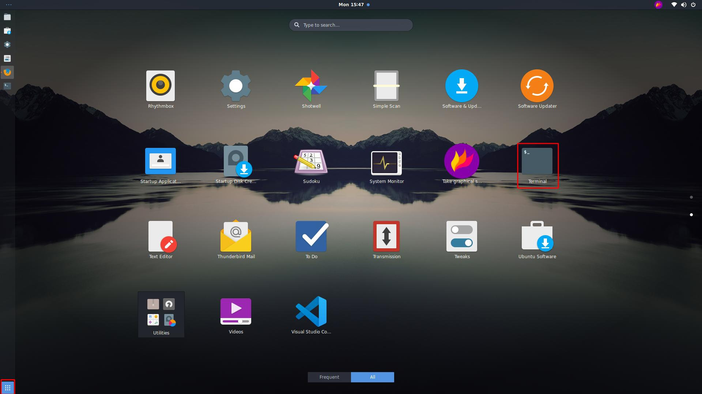
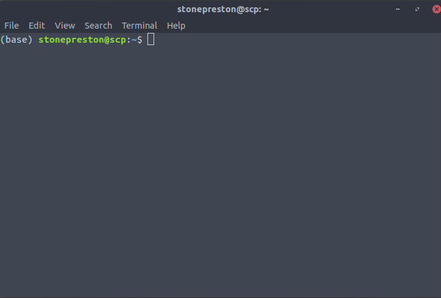
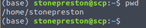

# OpenFOAM Cavity Tutorial

OpenFOAM Version: 6

Ubuntu Version: 18.04

The following tutorial aims to get a beginner linux user up to speed with using OpenFOAM with Ubuntu. A basic Unix primer is provided to help the user get aquainted with using terminal commands. The OpenFOAM walkthrough covers installation of OpenFOAM and the completion of the cavity case using BlockMesh for geometry definition. An alternative meshing approach using gmsh is also presented. 

## Basic Unix Commands

Log into your Ubuntu System. Open a terminal by pressing "cmd + a" (Mac keyboards) or "windows key + a" (Windows keyboards) to open a list of applications installed on your machine. Alternatively, you can press the menu button on the dock as shown below. Note: My icons and theme may be slightly different than yours.



Scroll down the list until you find the terminal application. You can right click the icon and add Terminal to your favorites. This will place the Terminal icon in your dock for easy access. Open Terminal by clicking the icon in the applications list or clicking it in your dock. A window like the one below will open.




Terminal allows the user to interact with a program called Bash. Bash is a type of program known as a shell and provides an interface to the system itself. A user can enter text commands to navigate the file system, install software, and do other common tasks using the shell interactively. Bash can also run script files.

### Navigating the File System

The directory system begins at the root directory represented by /. All files on the system exist within this directory. A special directory exists within / called home. The home directory contains directories corresponding to the users of the system. You will have a special directory just for you located at /home/your_username. This is referred to as YOUR home directory (whenever you see someone mention the home directory, they are usually referring to /home/your_username, not /home) and it is used quite often. This is where directories that store items like your Documents, Pictures, Downloads will be located. It is used so often that it has its own special shortcut, the tilde: ~. 

When you open Terminal, the current working directory will be your home directory. The current working directory is displayed as part of the prompt located to the left of your cursor in the terminal window. Your prompt should look something like this:

```your_username@your_computer_name:~$```

The text between the : and the $ is the current working directory. In this case you are currently in your home directory, represented by the tilde. You can also verify this using the pwd command (print working directory). You enter a command by typing its name and then pressing enter. 

```$ pwd```

Dont type the $. The $ signifies the end of the terminal prompt and will be used to indicate that the following line of code is intended to be entered as a terminal command. After typing the command and pressing enter, you should see the location of your home directory printed to the screen. 



Note: If you want to paste into the terminal window, you have to use ctrl + shift + v instead of the usual ctrl + v. Similarly to copy from the terminal window to the clipboard you must use ctrl + shift + c.

We can list files and directories that exist in the current working directory by typing the ls command (short for list):

```$ ls ```

ou should see a list of the familiar directories Documents, Pictures, etc. You can list the contents of a specific directory by passing the directory name as an argument to the ls command:

```$ ls Documents/ ```

Note that the terminal has an autocompletion feature. You can start typing the directory name Documents but press tab after typing the c character. It should autocomplete the rest of the name for you. Also note that we used a relative path to specify the directory name (relative to the current working directory.) We could have specified the abosolute path of the Documents directory using the root directory like so:

```$ ls /home/your_username/Documents/ ```

You can only use a relative path if the file or directory you want exists in the current working directory or in a subdirectory of the current working directory.

You probably dont have anything in this directory yet so you most likely did not see any output from the command. We will add a file to it soon. You can move to a different directory using the cd command (change directory):

```$ cd Documents/```

You will notice that your prompt changed. Now ~/Documents is between the : and the $. Your current working directory is now the Documents directory instead of ~. Let's add a file to this directory. A quick way to create a file is the touch command. We can specify a file name as an argument:

```$ touch hello_world.txt```

Let's get back to the home directory, which is one directory up from Documents. We could use ```$ cd ~``` or ```cd /home/your_username/```, but a common way to move up a single directory is to use a special dot notation:

```$ cd ../```

That should take you up one directory, back to your home directory. Another quick way to get back to ~ is to use the cd command without any arguments. 

```$ cd```

The terminal keeps a history of previously entered commands. Let's cycle back through our previous commands until we find the command to list the contents of the Documents directory. You can cycle through the commands by pressing the up an down arrows on your keyboard. Press the up arrow until you come to the following and hit enter:

```$ ls Documents/ ```

You should see the name of your newly created text file as output. That is the basics of file system navigation. 

### Creating Directories, Copying Files, Removing Files, and Moving Files

You can make a new directory using the mkdir command (make directory). Lets create a new directory inside documents called Stuff and use an absolute path just for fun:

```$ mkdir ~/Documents/Stuff```

Change into the newly created directory:

```$ cd ~/Documents/Stuff/```

We can copy our hello_world.txt file to this directory using the cp command. The cp command takes two arguments, the source file and the destination directory. The arguments are separated by a space. Since hello_world.txt exists one directory up, we can specify its path using the ../ syntax. We can also specify the current working directory as the destination using the . (dot) shortcut:

```$ cp ../hello_world.txt .```

The dot represents the current working directory and is used quite a bit, especially when copying files. You can list the contents of Stuff and see that it now contains a copy of the hello_world.txt file.

Let's remove the copy we just made using the rm command:

```$ rm hello_world.txt ```

You can remove directories using the same command, but you have to specify a recursive force flag. Flags are specified using a - followed by the flag characters. The flags for recursive and force are r and f. Lets copy the text file again, change to the Documents directory, and then delete the non-empty Stuff directory using the rm command:

    $ cp ../hello_world.txt .
    $ cd ../
    $ rm -rf Stuff/


